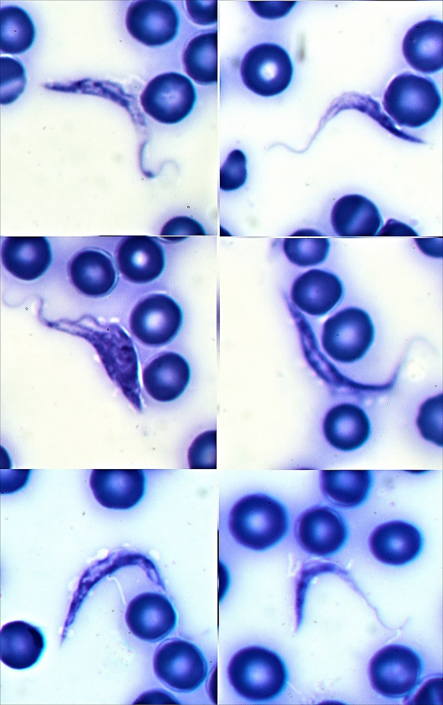
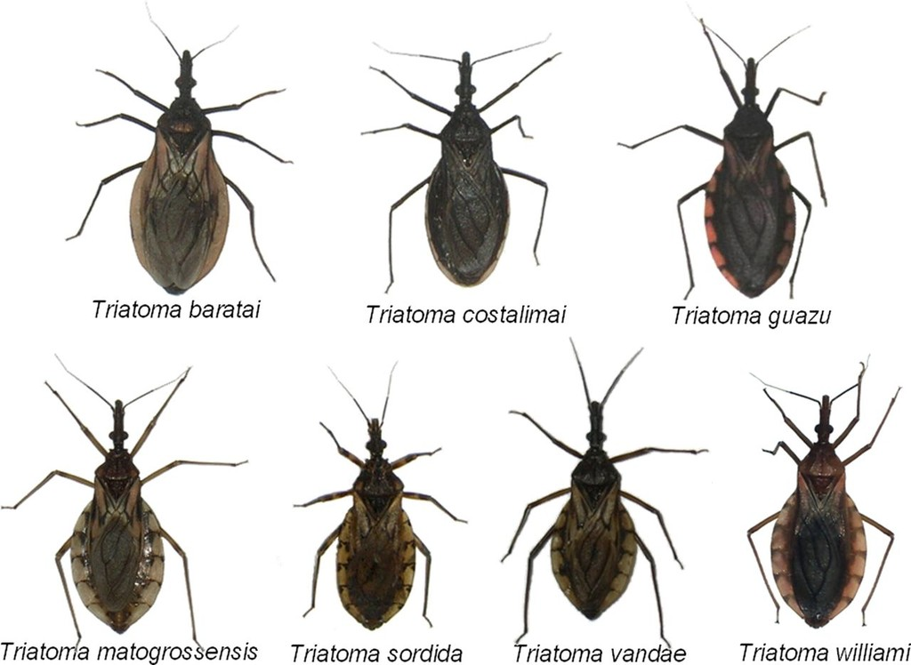
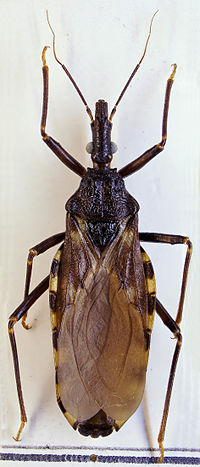

```{=html}
<style type="text/css">

h1.title {
  font-size: 40px;
  font-family: "Times New Roman", Times, serif;
  color: Black;
  text-align: center;
}

h4.author { /* Header 4 - and the author and data headers use this too  */
  font-size: 25px;
  font-family: "Times New Roman", Times, serif;
  font-weight: bold;
  color: #D02349;
  text-align: center;
}

body {
  font-family: Helvetica;
  font-size: 12pt;
}

.zoom {
  transform-origin: 40% 50% 0;
  transition: transform .2s;
  margin: 0 auto;
}
.zoom img{
	width:auto;
	height:auto;	
}
.zoom:hover {
  transform: scale(2);
}

th, td {padding: 5px;}

</style>
```


```{r Packages, message=FALSE, warning=FALSE, include=FALSE}
#install.packages('pacman')
pacman::p_load("leaflet","OpenStreetMap","maps", "sf","tidyverse")
```


```{r setup, include=FALSE}
knitr::opts_chunk$set(
	echo = FALSE,
	message = FALSE,
	warning = FALSE
)

library(ggplot2)
library(dplyr)
library(lme4)
library(lmerTest)
library(ggfortify)
library(MuMIn)
library(asbio)
library(GGally)
library(performance)
library(patchwork)
library(olsrr)
library(leaflet)
library(OpenStreetMap)
library(maps)

```


```{r include = FALSE}

knitr::opts_chunk$set(warning = FALSE, message = FALSE)
```


# Trypanosoma cruzi

The following dataset from Dryad details the distribution of *Trypanosoma cruzi* infections in humans and vectors across the globe. *Trypanosoma cruzi* is a parasite that infects people with the potentially fatal disease, chagas. It is distributed primarily by insects of the Genus *Triatoma*, or "Assassin bugs" or "Kissing Bugs", which are blood sucking insects. I have extracted the data for human infections in Argentina in 2010 and the nearest reported occurences of vectors to infected humans. 








```{r Simple Campus Map, fig.height=8, fig.width=10, message=FALSE, warning=FALSE, include=FALSE}
chaga <- read.csv("chaga/1_prevalence_humans.csv")

chaga2 <- chaga %>%
  filter(Country == "Argentina") %>%
  filter(Latitude_1 != "NA") %>%
  filter(Longitude_1 != "NA") %>%
  filter(Start_year == "2010") %>%
  filter(Site_name_1 != "Km 101") %>%
  filter(Site_name_1 != "Garto Colorado (urban zone)") %>%
  filter(Site_name_1 != "Garto Colorado (rural zone)") 


vect <- read.csv("chaga/4_prevalence_vectors.csv")

vect <- vect %>%
  filter(Country == "Argentina") %>%
  filter(Start_year == "2004") 

vect <- vect[c(8, 10, 11), ]


```


# Argentina


```{r Argentina Map, echo=TRUE, message=FALSE, warning=FALSE}


map_data_es <- map_data('world')[map_data('world')$region == "Argentina",]

map1 <- ggplot() +
    ## First layer: worldwide map
    geom_polygon(data = map_data("world"),
                 aes(x=long, y=lat, group = group),
                 color = '#9c9c9c', fill = '#f3f3f3') +
    ## Second layer: Country map
    geom_polygon(data = map_data_es,
                 aes(x=long, y=lat, group = group),
                 color = 'red', fill = 'pink') +
    coord_map() +
    coord_fixed(1.3,
                xlim = c(-78.5, -51.5),
                ylim = c(-56, -21)) +
    ggtitle("A map of Argentina") 

map1

```


```{r limits, echo=TRUE}

chagamap <- openmap(c(max(chaga2$Latitude_1)+0.2,min(chaga2$Longitude_1)-0.2),c(min(chaga2$Latitude_1)-0.2,max(chaga2$Longitude_1)+0.2),type='bing')

argentina <- openproj(chagamap, projection = "+proj=longlat +ellps=WGS84 +units=m +no_defs")

```


```{r Simple Campus Map2, echo=TRUE, fig.height=8, fig.width=10, message=FALSE, warning=FALSE}


map2 <- autoplot.OpenStreetMap(argentina) +
  geom_point(data=chaga2, aes(x = Longitude_1, y = Latitude_1, color = "red" ), size = 3, alpha = 0.8) +
  labs(title= "Chaga Testing Sites (Argentina 2010)", x="Longtiude", y="Latitude") + theme(legend.position = "none") +
  geom_text(data=chaga2, aes(x = Longitude_1, y = Latitude_1,label=Site_name_1), color="white", vjust=-.75, fontface="bold")

map2


```


# Testing Sites and Prevalence of Infection


```{r leaflet simple, echo=TRUE, fig.height=6, fig.width=8, message=FALSE, warning=FALSE}


map3 <- leaflet() %>% 
  addTiles(group = "OSM")%>%
  addProviderTiles(providers$CartoDB.Positron, group = "CartoDB") %>%
  addProviderTiles(providers$Esri.NatGeoWorldMap, group = "NatGeo") %>%
  addProviderTiles(providers$Esri.WorldImagery, group = "ESRI") %>%
  setView(lng = -60.51221, lat = -28.97234, zoom = 9.5) %>%
  addCircleMarkers(popup = chaga2$Site_name_1,
                   label = chaga2$Prevalence,
                   lng = chaga2$Longitude_1, 
                   lat = chaga2$Latitude_1,
                   weight = 2,
                   color = "grey",
                   fillColor = "blue",
                   fillOpacity = .7) %>%
  addLayersControl(
    baseGroups = c("OSM", "CartoDB", "NatGeo", "ESRI"),
    options = layersControlOptions(collapsed = FALSE))

map3


```


# Testing Sites and Infection in hosts & vectors


```{r leaflet simple2, echo=TRUE, fig.height=6, fig.width=8, message=FALSE, warning=FALSE, cache=FALSE}

map4 <- leaflet() %>% 
  addTiles(group = "OSM")%>%
  addProviderTiles(providers$CartoDB.Positron, group = "CartoDB") %>%
  addProviderTiles(providers$Esri.NatGeoWorldMap, group = "NatGeo") %>%
  addProviderTiles(providers$Esri.WorldImagery, group = "ESRI") %>%
  setView(lng = -61.51221, lat = -28.12345, zoom = 8) %>%
  addCircleMarkers(popup = chaga2$Site_name_1,
                   label = chaga2$Prevalence,
                   lng = chaga2$Longitude_1, 
                   lat = chaga2$Latitude_1,
                   weight = 1,
                   color = "grey",
                   fillColor = "blue",
                   fillOpacity = .7) %>%
  addCircleMarkers(popup = vect$Host,
                   label = vect$No_Positive,
             lng = vect$Longitude_1,
             lat =vect$Latitude_1,
             weight = 2,
             color = "black",
             fillColor = "red",
             fillOpacity = .7) %>%
  addLayersControl(
    baseGroups = c("OSM", "CartoDB", "NatGeo", "ESRI"),
    options = layersControlOptions(collapsed = FALSE))

map4

```





